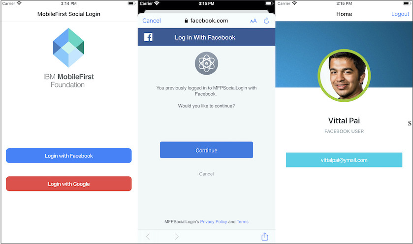

IBM MobileFirst Foundation
===
## Social Login

A sample Ionic 5.x application demonstrating use of the Social Authentication using MobileFirst Credentials Validation Security Check.

### Tutorials
https://mobilefirstplatform.ibmcloud.com/blog/2016/04/06/social-login-with-ibm-mobilefirst-platform-foundation/

### Usages

## Version
Ionic 5.1.0

## Supported Versions
IBM MobileFirst Foundation 8.0

## Licence
Copyright 2020 IBM Corp.

Licensed under the Apache License, Version 2.0 (the "License");
you may not use this file except in compliance with the License.
You may obtain a copy of the License at

http://www.apache.org/licenses/LICENSE-2.0

Unless required by applicable law or agreed to in writing, software
distributed under the License is distributed on an "AS IS" BASIS,
WITHOUT WARRANTIES OR CONDITIONS OF ANY KIND, either express or implied.
See the License for the specific language governing permissions and
limitations under the License.s