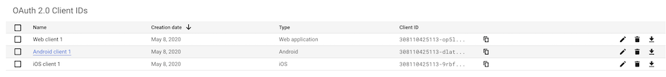
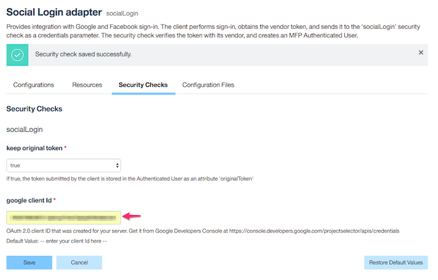

IBM MobileFirst Foundation
===
## Social Login

A sample Ionic 5.x application demonstrating use of the Social Authentication using MobileFirst Credentials Validation Security Check.

### Tutorials
https://mobilefirstplatform.ibmcloud.com/blog/2016/04/06/social-login-with-ibm-mobilefirst-platform-foundation/


## Prerequisites
* [Installed Git](https://git-scm.com/book/en/v2/Getting-Started-Installing-Git)
* [Registered Facebook Android App](https://developers.facebook.com/docs/android/getting-started)
* [Registered Google Sign-In App for Android](https://developers.google.com/identity/sign-in/android/start-integrating#get-config)
* [Installed Android Studio](https://developer.android.com/studio/install.html)
* [Installed MobileFirst development environment](https://mobilefirstplatform.ibmcloud.com/tutorials/en/foundation/8.0/installation-configuration/development/mobilefirst/)


#### Configuring the Ionic app

##### Facebook Authentication

- Register Android and iOS app with the id `com.mfp.sociallogin` by following steps as mentioned [here]().
    * Copy Facebook App ID  & App Name from [Facebook Apps Console](https://developers.facebook.com/apps/)
    * 

- Edit the file **package.json**, there you need supply the following:
    ``` 
    "cordova-plugin-facebook4": {
            "APP_ID": "Add your Facebook APP ID here",
            "APP_NAME": "Add your Facebook App Name here"
    }
    ```

##### Google Authentication
    
- Register your Android and iOS app with the id `com.mfp.sociallogin` from [Google APIs Console](https://console.developers.google.com/apis/credentials).
    * 

- For iOS, Download the plist file from Google APIs Console and Copy the Reverse Client ID.
    * Edit the file **package.json**, there you need supply the following:
    ``` 
    "cordova-plugin-googleplus": {
        "REVERSED_CLIENT_ID": "Add your iOS Reverse Client ID here"
    }
    ```
- For Android, There is no need to add the generated google-services.json file into your Ionic project.


#### Configuring the Adapter

- Deploy ([SocialLogin SecurityCheck](./adapters/SocialLoginSecurityCheck) and [HelloSocialUser Adapter](./adapters/HelloSocialUserAdapter)) by running following commands in the project's root directory using command line:
    * Run `cd adapters`
    * Run `mfpdev adapter build all`
    * Run `mfpdev adapter deploy all`

- From your command line run `mfpdev server console` - this command will open your server console.
  * From the Adapters menu click on *Social Login Adapter* and navigate to *Security Checks* tab.
  * Here you will find place to add your *google client id*.  This ID will use the adapter to validate the Google account.
  * This ID you can retreive it from [Google APIs Console](https://console.developers.google.com/apis/credentials)
  * If you need to use the social platform token later on, set the **keep original token** attribute to be **true**.
  * 


### Usage

1. From a command-line window, navigate to the project's root folder and run the following commands:
    - `ionic cordova platform add` - to add a platform.
    - `mfpdev app register` - to register the application.
    - `mfpdev app push` - to add the `liveupdate.mobileclient` scope in scope elements mappings section of security.
   
2. Add Liveupdate Features & Properties as shown below in **MobileFirst Operations Console → [your application] → Liveupdate Settings → Schema**.


3. Run the application in an Android Emulator, iOS Simulator, Browser or physical device with the following command.
    - `ionic cordova run` - to run the application. 


### Changing Live Update Settings

In **MobileFirst Operations Console → [your application] → Live Update Settings → Schema tab**

#### Feature Rollout
click on the **Edit** icon of  **festivalShopping**  feature under Features section and Change the default value to **On** or *Off** to enable/disable the feature remotely.
 
#### Feature Properties
* Click the **Edit** icon of **buttonLabel** under Properties section and change the value to update the feature properties remotely.

## Version
Ionic 5.1.0

## Supported Versions
IBM MobileFirst Foundation 8.0

## Licence
Copyright 2020 IBM Corp.

Licensed under the Apache License, Version 2.0 (the "License");
you may not use this file except in compliance with the License.
You may obtain a copy of the License at

http://www.apache.org/licenses/LICENSE-2.0

Unless required by applicable law or agreed to in writing, software
distributed under the License is distributed on an "AS IS" BASIS,
WITHOUT WARRANTIES OR CONDITIONS OF ANY KIND, either express or implied.
See the License for the specific language governing permissions and
limitations under the License.s